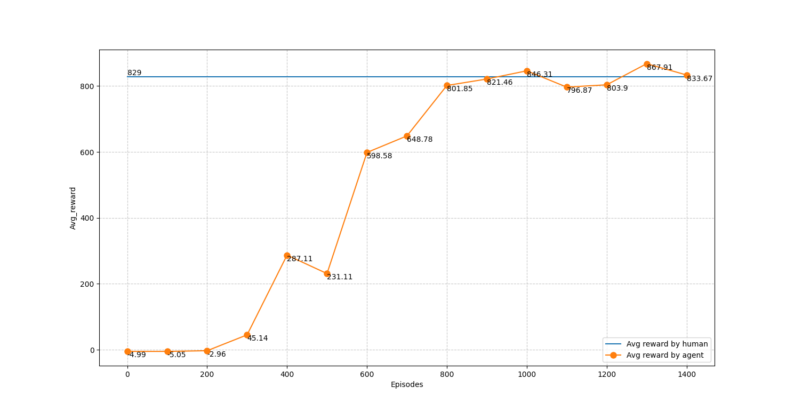
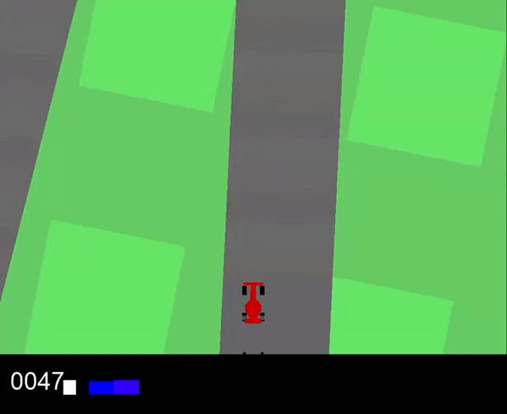
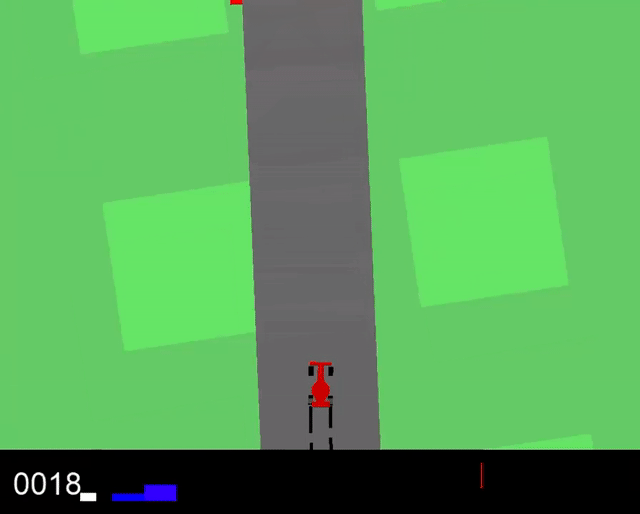
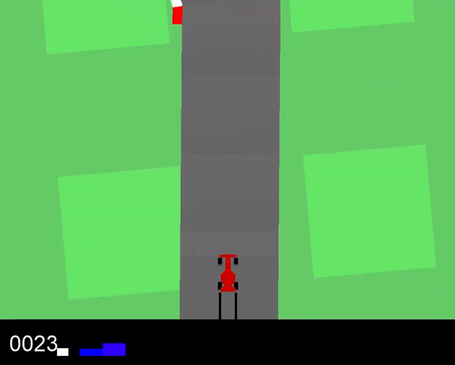

# CS181-2023fall

This is the CS181 final project, owned by Qijch, Shijy, Xuchh, Zhaozy and Zhuyh.

## Trainning Results
We can see that the reward rises rapidly before 800 episodes and keep stay after that.
<br>


#### Training After 100 Episodes
<br>


#### Training After 400 Episodes
<br>


#### Training After 1000 Episodes
<br>


## Usage

### Play By Human
You can try the car_racing game by yourself by using the following command and the score of each game will be saved in `data_human.csv`
```
python car_by_human.py
```

### Train
You can train model by using the following command and the model and reward will be saved in
`model_self` and `reward_self`
```
python train_agent.py
```

### Test
You can test the model in `model` or `model_self` by using the following command, and change the `PRETRAINED_PATH` in `test_agent.py` to change the model.
```
python test_agent.py
```